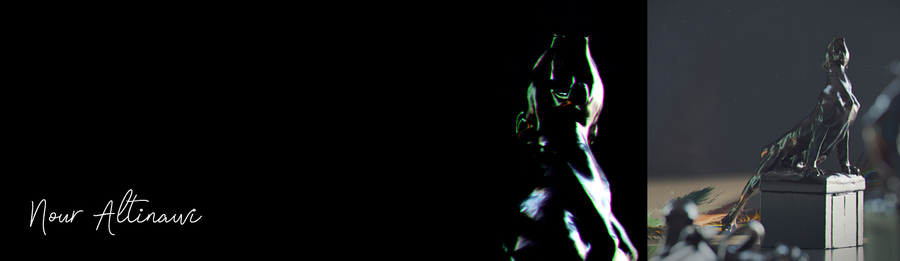

---

👋 Hi, I'm Nour

🚀 Real-Time Web 3D Systems Engineer  
🎨 20+ years in 3D Visualization → now building performance-driven WebGL systems

I don’t just build 3D scenes —  
I design structured, scalable real-time systems that perform under real-world constraints.

---

💡 Focus

• High-performance WebGL architecture (Three.js)  
• Adaptive loading systems & runtime decision logic  
• Mobile-first performance (60 FPS targets)  
• Clean, system-driven front-end engineering  

---

🧠 Tech Stack

Three.js · WebGL · TypeScript · SvelteKit · .NET · REST APIs · 3ds Max  

---

🏗️ Featured Work

**Nordic RT** — Real-time architectural system  

• ~2.5s initial load  
• Stable ~60 FPS on mobile  
• Phase-based loading + adaptive performance system  

---

💼 Open to

Frontend · WebGL · Creative Development · UI Engineering  
(Performance-driven, real-time systems)

---

📌 Explore my pinned projects below

---

📫 Connect

💼 [LinkedIn](https://www.linkedin.com/in/nour-tinawi)  
🌐 [Portfolio](https://pure-art.co)
